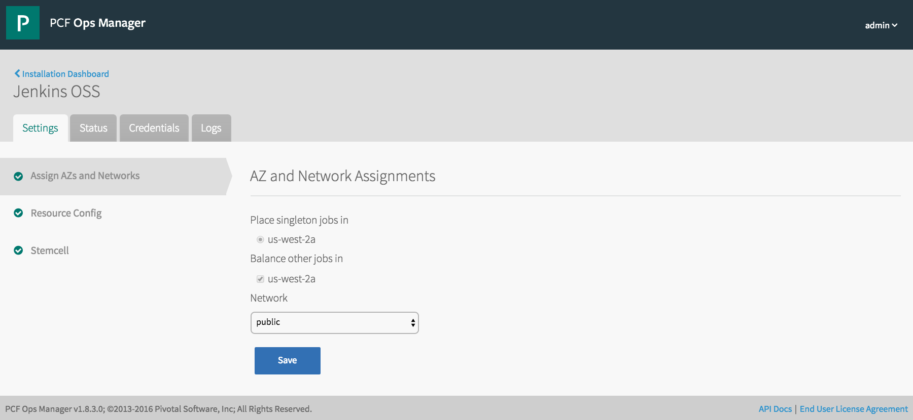

= Jenkins OSS Tile for Pivotal Cloud Foundry
This repository contains instructions for building a Docker-backed Bosh Managed Jenkins OSS tile for Pivotal Cloud Foundry (tested with Pivotal Cloud Foundry Elastic Runtime 1.8.4).  

This tile makes use of the official link:https://github.com/cloudfoundry-community/docker-boshrelease[Docker Bosh Release] -- the fastest way to orchestrate Docker containers with persistent data on any infrastructure.

After working through this lab you will have a functioning Docker-backed singlenode Jenkins service managed by Bosh.

Please take a moment to review the Docker-Bosh 

== Requirements
. link:http://docs.pivotal.io/pivotalcf/1-8/customizing/[Pivotal Ops Manager]
. linnk:http://bosh.io/docs/bosh-cli.html[BOSH CLI]
. link:http://cf-platform-eng.github.io/isv-portal/tile-generator/[Tile Generator Tools]
. link:https://docs.docker.com/engine/installation/linux/ubuntulinux/[Docker]

== Install Tile Generator Tools 
. Read through the Pivotal Cloud Foundry Engineering ISV Documentation for custom PCF tile creation: http://cf-platform-eng.github.io/isv-portal/tile-generator/
. Install tile-generator tools according to the documentation: http://cf-platform-eng.github.io/isv-portal/tile-generator/
. Create Ops Manager Metadata for the Pcf utility to make Ops Manager queries on your behalf (only for PCF)
+
----
$ touch metadata
$ echo "---" >> metadata
$ echo "opsmgr:" >> metadata
$ echo "    url: https://opsman.your-company.com" >> metadata
$ echo "    username: webuser" >> metadata
$ echo "    password: webpass" >> metadata
----

. Test your installation of Tile Generator tools. Anywhere the Pcf utility is run the _metadata_ file must exist in working directory:
+
----
$ pcf products
- cf 1.8.4-build.3 (installed)

$ tile
Usage: tile [OPTIONS] COMMAND [ARGS]...

Options:
  --help  Show this message and exit.

Commands:
  build
  init
----

== Install Docker
. Please Refer to the official instructions for link:https://docs.docker.com/engine/installation/linux/ubuntulinux/[Docker]

== Build A Custom Tile: Jenkins OSS
. Pull the latest Jenkins Docker image
+
----
$ docker pull jenkins
----

. Create a tile.yml manifest:
+
----
---
name: jenkins
icon_file: resources/cf-jenkins.png  # 128p x 128p PNG file
label: Jenkins OSS
description: A Community OSS Jenkins Tile for Pivotal Cloud Foundry

properties:
- name: author
  type: string
  label: Author
  value: admin@your-company.com

docker_release:
 - name: docker
   version: latest

packages:
- name: jenkins
  type: docker-bosh

  # Requires included Docker images
  docker_images:
  - jenkins

  # Instance settings configurable by Ops Man GUI
  instance_type: 'c4.large'
  cpu: 2
  memory: 3840
  ephemeral_disk: 8192
  persistent_disk: 20480
  instances: 1

  # This is the Docker app to run
  manifest: |
    containers:
    - name: jenkins
      image: "jenkins"
      bind_volumes:
      - "/var/jenkins_home"
      bind_ports:
      - "8080:8080"
      - "50000:50000"

stemcell_criteria:
  version: '3262.19'

----

. Build the custom tile (see sample OSS CF manifest if you dont have an Ops Manager)
+
----
$ tile build

name: jenkins
icon: resources/cf-jenkins.png
label: Jenkins OSS
description: A Community OSS Jenkins Tile for Pivotal Cloud Foundry
version: 0.0.1
stemcell_criteria:
  os: ubuntu-trusty
  version: 3262.19
tile adding package jenkins
tile building bosh release for jenkins
bosh init release
bosh generate package jenkins
bosh generate job docker-bosh-jenkins
bosh generate package common
bosh upload blobs
bosh create release --force --final --with-tarball --version 0.0.1
tile import release docker
tile generate metadata
tile generate content-migrations
tile generate migrations
tile generate package
tile import release jenkins

created tile jenkins-0.0.1.pivotal
----

. Upload Tile to Pivotal Cloud Foundry
+
----
$ pcf import products/jenkins-0.0.1.pivotal
----

. Verify new product is installed with Pcf utility:
+
----
$ pcf products

 - jenkins 0.0.1 (installed)
- cf 1.8.4-build.3 (installed)
----

. Add Jenkins tile to dashboard
+
----
$ pcf install jenkins 0.0.1
----
+

. Use OpsManager to configure and deploy the tile
+

. Check the new Bosh Releases on your system (docker and Jenkins have just been added):
+
----
$ bosh releases
Acting as user 'director' on 'p-bosh-8f96b683c9e517b2d3d1'
RSA 1024 bit CA certificates are loaded due to old openssl compatibility

+---------------------------+-----------+-------------+
| Name                      | Versions  | Commit Hash |
+---------------------------+-----------+-------------+
| docker                    | 23*       | 82346881+   |
| jenkins                   | 0.0.1*    | d07962a5+   |
+---------------------------+-----------+-------------+
(*) Currently deployed
(+) Uncommitted changes

----

. Check the Bosh Deployments on your system
+
----
ubuntu@ip-10-0-0-50:~/pcf-docker-bosh-tiles/jenkins$ bosh deployments
Acting as user 'director' on 'p-bosh-8f96b683c9e517b2d3d1'
RSA 1024 bit CA certificates are loaded due to old openssl compatibility

+------------------------------+-------------------------------+-------------------------------------------------+--------------+
| Name                         | Release(s)                    | Stemcell(s)                                     | Cloud Config |
+------------------------------+-------------------------------+-------------------------------------------------+--------------+
| jenkins-8701f08726c371e05fda | docker/23                     | bosh-aws-xen-hvm-ubuntu-trusty-go_agent/3262.19 | latest       |
|                              | jenkins/0.0.1                 |                                                 |              |
+------------------------------+-------------------------------+-------------------------------------------------+--------------+
----

. Check your newly running VM's status:
+
----
Acting as user 'director' on 'p-bosh-8f96b683c9e517b2d3d1'
RSA 1024 bit CA certificates are loaded due to old openssl compatibility
Deployment 'jenkins-8701f08726c371e05fda'

Director task 178

Task 178 done

+--------------------------------------------------------------+---------+------------+----------+------------+
| VM                                                           | State   | AZ         | VM Type  | IPs        |
+--------------------------------------------------------------+---------+------------+----------+------------+
| docker-bosh-jenkins/0 (37370cee-cf3d-412f-a4d4-8bf04698f8cf) | running | us-west-2a | c4.large | 10.0.0.100 |
+--------------------------------------------------------------+---------+------------+----------+------------+

VMs total: 1
----

== Configuring deployed Jenkins
. Navigate to your newly running application in a browser, you might need to map DNS or create a load balancer

. Bosh-SSH Into the *docker-bosh-jenkins* instance:
+
----
$ bosh deployment /var/tempest/workspaces/default/deployments/jenkins-8701f08726c371e05fda.yml
$ bosh ssh
RSA 1024 bit CA certificates are loaded due to old openssl compatibility
Acting as user 'director' on deployment 'jenkins-8701f08726c371e05fda' on 'p-bosh-8f96b683c9e517b2d3d1'
Target deployment is 'jenkins-8701f08726c371e05fda'

Setting up ssh artifacts

Director task 183

Task 183 done
Starting interactive shell on job docker-bosh-jenkins/0
Unauthorized use is strictly prohibited. All access and activity
is subject to logging and monitoring.
Welcome to Ubuntu 14.04.5 LTS (GNU/Linux 3.19.0-69-generic x86_64)

 * Documentation:  https://help.ubuntu.com/

The programs included with the Ubuntu system are free software;
the exact distribution terms for each program are described in the
individual files in /usr/share/doc/*/copyright.

Ubuntu comes with ABSOLUTELY NO WARRANTY, to the extent permitted by
applicable law.

Last login: Sun Oct  2 05:42:03 2016 from 10.0.0.50
To run a command as administrator (user "root"), use "sudo <command>".
See "man sudo_root" for details.

bosh_k5l5thtm0@cebd95d7-50e5-4699-bd29-68dfb1606a91:~$
----

. Check out Docker-Bosh and Monit logs
+
----
$ sudo su
$ cd /var/vcap/sys/log
$ ls -al

total 32
drwxr-x--- 6 root vcap 4096 Oct  2 05:19 .
drwxr-x--- 5 root vcap 4096 Oct  2 05:19 ..
drwxrwxr-x 2 vcap vcap 4096 Oct  2 05:19 containers
drwxrwxr-x 2 vcap vcap 4096 Oct  2 05:19 docker
drwxr-xr-x 2 vcap vcap 4096 Oct  2 05:19 docker-bosh-jenkins
-rw-r--r-- 1 root root  120 Oct  2 05:19 docker-bosh-jenkins_ctl.err.log
-rw-r--r-- 1 root root  120 Oct  2 05:19 docker-bosh-jenkins_ctl.log
drwxr-xr-x 2 root root 4096 Oct  2 05:19 monit
----

. Find the auto-generated password in the Jenkins Container startup logs:
+
----
$ cd /var/vcap/store/docker/docker/containers/c3c59ce38b4bbb45fea35f074080674370072127780d051b73d4c9729b3c796a
$ cat c3c59ce38b4bbb45fea35f074080674370072127780d051b73d4c9729b3c796a-json.log

{"log":"Jenkins initial setup is required. An admin user has been created and a password generated.\n","stream":"stderr","time":"2016-10-02T05:20:24.114393787Z"}
{"log":"Please use the following password to proceed to installation:\n","stream":"stderr","time":"2016-10-02T05:20:24.114399047Z"}
{"log":"99e74f081850426793a2a4bc6436ebb3\n","stream":"stderr","time":"2016-10-02T05:20:24.114409232Z"}
{"log":"This may also be found at: /var/jenkins_home/secrets/initialAdminPassword\n","stream":"stderr","time":"2016-10-02T05:20:24.114419083Z"}
----

== Congratulations!
You now have a working Jenkins Deployment backed by Docker, and managed by Bosh

